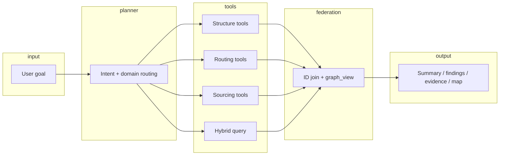

# Enterprise graph design and agent-driven integrated analysis

Design proposal for manufacturing knowledge graphs and AI-assisted cross-domain analysis, grounded in how enterprises actually own and ship BOM, routing, and sourcing data. This repository implements the stack on **LanceDB** (graph + vector) and **DuckDB** (relational attributes); this document does not assume a managed graph database.

**Audience:** architects, data platform owners, and agent developers extending this repository.

**Related:** [project-layout.md](project-layout.md) (directory structure) · [development.md](development.md) (setup and roadmap) · [ontology-on-lance.md](ontology-on-lance.md) (schema-light Lance vs ontology layers) · [supply-chain-disruption-response.md](supply-chain-disruption-response.md) (disruption playbooks and logical federation) · [AGENTS.md](../AGENTS.md) (ontology SSOT) · [local-demo-runbook.md](local-demo-runbook.md) (running the agent).

---

## 1. Executive summary

| Question | Recommendation |
|----------|----------------|
| One integrated graph or three separate graphs? | **Three logical domains** (product structure, manufacturing routing, supply & sourcing), joined by **shared component (and product) IDs**. Physical layout is an operational choice. |
| Physical storage on Lance | Start with **one LanceDB dataset, logical separation via `graph_id`**; split into separate LanceDB paths or tables per domain when team boundaries or ingest pipelines require it. |
| Role of ontology | **One authoring SSOT** (`ontology/schema.py`) exporting **domain bundles** for Skills and validation; each bundle documents semantics for agents and humans. |
| Role of the AI agent | **Intent → domain tool selection → federated execution → grounded narrative**; cross-domain answers are composed in a federation layer, not by merging ontologies at prompt time. |

The demo in this repository today is a **single physical graph** that already mixes all three domains. That is appropriate for PoC and end-to-end demos. Enterprise rollout should **clarify domain boundaries in schema and tools first**, then split physical stores only when ownership or pipelines demand it.

---

## 2. Enterprise reality: where the data lives

Manufacturing companies rarely have one system that owns the full supply chain picture. Typical sources:

| Domain | Typical systems | Owning org | Update cadence | Master data |
|--------|-----------------|------------|----------------|-------------|
| **Product structure (EBOM)** | PLM (Windchill, Teamcenter, ENOVIA, etc.) | Engineering | ECO / revision events | Part number, revision, where-used |
| **Manufacturing routing** | MES, ERP PP, APS | Manufacturing / operations | Daily to real-time | Routing, work center, cycle time |
| **Supply & sourcing** | SRM, ERP MM, procurement analytics | Procurement | Contract / price / supplier changes | Supplier, lead time, risk, alternates |

Implications for graph design:

1. **No single team owns the whole graph** — governance must respect domain boundaries.
2. **Identifiers must align** — e.g. `COMP-103` in PLM must resolve to the same entity in sourcing and routing feeds.
3. **Freshness differs** — routing may change hourly; EBOM changes on release; supplier risk may change weekly.
4. **Compliance** — sourcing contracts or risk scores may not be co-located with engineering BOM in every jurisdiction.

A graph platform that ignores these boundaries becomes hard to adopt. A graph platform that **only** splits physically without a federation story makes cross-domain questions (the main value of an agent) expensive to answer.

---

## 3. Three logical graphs (recommended semantics)

Treat the manufacturing supply chain as **three bounded contexts**. Each has its own allowed node and edge types. They connect through **bridge entities**, primarily `Component` and secondarily `Product`.

### 3.1 Product structure graph (EBOM)

**Purpose:** Design intent — what goes into what.

| Nodes | Edges | Example question |
|-------|-------|------------------|
| `Component`, `Product` | `USED_IN` (Component → Product) | “Where is `COMP-103` used?” “What is the BOM for `PROD-901`?” |

**Enterprise source:** PLM export, engineering release pipeline.

**Current repo mapping:** `USED_IN` edges and `Component` / `Product` nodes in `ontology/schema.py`.

### 3.2 Manufacturing routing graph

**Purpose:** How products are built — processes, work centers, material consumption at operations.

| Nodes | Edges | Example question |
|-------|-------|------------------|
| `Component`, `Process`, `Product` | `INPUT_OF` (Component → Process), `PRODUCED_BY` (Product → Process) | “Which products depend on work center `WC-12`?” “What is the cycle-time path for `PROD-901`?” |

**Enterprise source:** MES / ERP routing, standard work libraries.

**Current repo mapping:** `Process` nodes; `INPUT_OF`, `PRODUCED_BY` in `schema.py`. Node fields `work_center`, `cycle_time_min` support capacity-style analysis.

### 3.3 Supply & sourcing graph

**Purpose:** Who supplies what, with commercial and risk context.

| Nodes | Edges | Example question |
|-------|-------|------------------|
| `Component`, `Supplier` | `SUPPLIED_BY` (Component → Supplier) | “Which products are exposed to high-risk suppliers?” “Single-source components for `PROD-900`?” |

**Enterprise source:** SRM, ERP vendor master, risk feeds.

**Current repo mapping:** `Supplier` nodes (`country`, `risk_level`); `SUPPLIED_BY` with optional edge properties (e.g. `lead_time_days` in seed data).

### 3.4 Bridge keys (federation contract)

```
[Supply]     SUP-001 ──SUPPLIED_BY──► COMP-103
                                        │
[Structure]              PROD-901 ◄──USED_IN──┘
                                        │
[Routing]      PROC-10 ◄──INPUT_OF──────┘
```

| Bridge | Rule |
|--------|------|
| `Component.id` | **Required** shared key across all three domains |
| `Product.id` | Shared between structure and routing (`PRODUCED_BY`) |
| `Supplier.id`, `Process.id` | Domain-local unless explicitly mastered elsewhere |

Identity resolution (aliases, legacy part numbers, manufacturer PN) belongs in a **canonical component registry** (DuckDB table or dedicated master API), not in ad hoc graph merges.

---

## 4. Physical layout on LanceDB

LanceDB in this repository holds:

- **Graph:** `graph_nodes`, `graph_edges` (`LanceGraphStore`)
- **Vector:** `component_vectors` (`UnifiedBomContextStore`)
- **RDB:** `data/bom.duckdb` — authoritative scalar attributes for components

All are local paths under `data/` (see [development.md](development.md)).

### 4.1 Phase A — Logical three, physical one (recommended first step)

Keep a **single LanceDB path** (`data/lancedb`) and add a **`graph_id`** column on nodes and edges:

| `graph_id` | Contents |
|------------|----------|
| `structure` | `Component`, `Product`, `USED_IN` |
| `routing` | `Component`, `Process`, `Product`, `INPUT_OF`, `PRODUCED_BY` |
| `sourcing` | `Component`, `Supplier`, `SUPPLIED_BY` |

`Component` rows may appear in more than one graph (same `id`, different `graph_id` or a shared `component_master` table). Traversal APIs filter by `graph_id` and allowed edge types for that domain.

**Why this fits Lance:** LanceDB is columnar and embeddable; filtering by `graph_id` in Python traversal (as `LanceGraphStore` already does in-process) is cheap at manufacturing BOM scale. No need for a separate graph server.

### 4.2 Phase B — Physical three (when org boundaries require it)

Split LanceDB datasets by domain or by owning team:

```
data/
  lancedb-structure/   # graph_nodes, graph_edges
  lancedb-routing/
  lancedb-sourcing/
  lancedb-vectors/     # or one shared vector index keyed by component id
  bom.duckdb           # shared RDB + identity registry
```

Introduce a thin **`GraphFederationStore`** that:

1. Accepts a domain tool call (e.g. `sourcing.supplier_impact`).
2. Runs traversal on the correct `LanceGraphStore` instance.
3. Returns node IDs for follow-up calls on another domain (e.g. structure `where_used`).

### 4.3 When to stay on one physical graph

- Single data platform team and unified ingest
- PoC, demos, and agent UX prototyping (current repository state)
- Heavy cross-domain path queries (e.g. supplier → component → process → product) where round-trips across three stores add latency without governance benefit

### 4.4 When to split physically

- Independent release trains per domain (PLM connector vs SRM connector)
- Different write ACLs or data residency per domain
- Very large edge counts where per-domain compaction and retention policies differ

---

## 5. Ontology strategy

Follow the pattern already established in this repo:

| Layer | Location | Responsibility |
|-------|----------|----------------|
| Authoring SSOT | `ontology/schema.py` | Pydantic models, `ALLOWED_EDGES`, validators on write |
| Published artifact | `skills/bom-ontology/assets/ontology.json` | Generated via `scripts/sync_ontology.py` for Agent Skills |
| Exploration playbooks | `skills/bom-graph-explorer/` | How to traverse; no second copy of schema |

### 5.1 Domain bundles (proposed extension)

Export or document **three bundles** from the same SSOT (names illustrative):

- `structure` — `Component`, `Product`, `USED_IN`
- `routing` — `Component`, `Process`, `Product`, `INPUT_OF`, `PRODUCED_BY`
- `sourcing` — `Component`, `Supplier`, `SUPPLIED_BY`

Each bundle includes:

- Node property definitions and constraints
- Allowed edge pairs (subset of `ALLOWED_EDGES`)
- **Natural-language semantics** for agents (e.g. “`SUPPLIED_BY` direction: component is supplied by supplier”)

Agent Skills can ship as:

- `bom-ontology` — full schema (current)
- `bom-graph-explorer` — workflows per domain plus **federation workflows** (multi-step)

Validation remains **one write path** through Pydantic; domain bundles are views, not competing schemas.

---

## 6. Hybrid context: vector + RDB + graph

`UnifiedBomContextStore` models a common enterprise pattern:

```
User query (natural language)
        │
        ▼
  Vector search (LanceDB)     ──► candidate component IDs
        │
        ▼
  RDB lookup (DuckDB)         ──► authoritative name, material, cost
        │
        ▼
  Graph traversal (domain)    ──► impact, path, risk
```

| Store | Role in enterprise terms |
|-------|---------------------------|
| Vector | Fuzzy match on descriptions, specs, legacy names |
| DuckDB | System of record for attributes used in reports |
| Graph | Relationships and multi-hop reasoning |

For enterprise deployment, replace the demo SHA256 embedding with your embedding model and sync vectors from the same component master that feeds graph nodes.

---

## 7. AI agent architecture for integrated analysis

The autonomous agent in `app/agent/` already separates:

- **Skills** (prompt + workflow guidance)
- **Tools** (deterministic graph/hybrid executors)
- **Planner** (heuristic or LLM via LiteLLM)
- **Summarizer** (grounded narrative + evidence)
- **Telemetry** (Langfuse for operator/debug view)

### 7.1 Target runtime flow



1. **Classify intent** — supplier disruption, where-used, routing bottleneck, material search, or compound.
2. **Select domain tool(s)** — prefer single-domain tools; add a second hop only when the goal requires it.
3. **Execute deterministically** — tools return JSON; no hallucinated IDs.
4. **Federate** — join on `component_id` / `product_id`; build `graph_view` for the UI.
5. **Summarize** — LLM or heuristic explanation **only from tool JSON** (see `app/agent/llm_client.py` contract).

### 7.2 Tool map: today vs proposed

| User intent (examples) | Domain(s) | Tool today | Proposed |
|------------------------|-----------|------------|----------|
| “Impact if `SUP-001` fails” | Sourcing → Structure | `bom_supplier_impact` | Same; optionally split internal traversal |
| “Path `COMP-103` → `PROD-901`” | Structure + Routing | `bom_supply_path` | `structure.path` + `routing.path` or federated composer |
| “Parts similar to steel housing” | Vector → Sourcing → Structure | `bom_hybrid_query` | Same pattern with explicit domain labels in response |
| “Products affected if `WC-12` is down” | Routing → Structure | — | `bom_work_center_impact` |
| “High-risk country exposure by product” | Sourcing → Structure | — | `bom_sourcing_risk_by_product` |
| “Single-source components for `PROD-900`” | Sourcing + Structure | — | `bom_single_source_components` |

Keep tool outputs stable and testable (`uv run pytest -q tests/test_agent.py`). The LLM plans and explains; it does not replace graph math.

### 7.3 Planner modes

| Mode | Use case |
|------|----------|
| `tools` | Heuristic planner (`plan_tools_from_goal`) — CI, offline, no API key |
| `llm` | OpenAI-compatible gateway (LiteLLM) selects tools from JSON schemas |
| `auto` | LLM if configured, else heuristic |

Enterprise recommendation: **LLM planner in production**, heuristic fallback for resilience; log all plans to Langfuse ([observability.md](observability.md)).

### 7.4 Grounding and evidence

User-facing responses intentionally omit raw tool JSON ([README.md](../README.md)). Evidence must cite facts present in tool results (`app/agent/user_response.py`, `app/agent/llm_client.py`). For regulated environments, extend evidence with:

- `domain` — structure | routing | sourcing
- `source_system` — ingest metadata on nodes/edges
- `as_of` — snapshot timestamp per graph_id

---

## 8. Scenario walkthroughs

### 8.1 Supplier disruption (sourcing → structure)

**Situation:** Procurement flags that `SUP-001` (Japan, high risk) may stop shipments.

**Agent plan:**

1. `bom_supplier_impact` / `sourcing.impacted_components(supplier_id=SUP-001)`
2. For each component, `structure.products_for_component(component_id)`
3. Rank by `component_cost` from DuckDB

**Outcome:** List of products and revenue-critical parts; supply chain map highlights supplier → component → product.

**Stakeholders:** procurement, program management, engineering (substitute parts).

### 8.2 Work center outage (routing → structure)

**Situation:** `WC-12` (final assembly) scheduled maintenance for 48 hours.

**Agent plan:**

1. `routing.products_by_work_center(work_center=WC-12)` via `Process.work_center`
2. `structure.bom_explode(product_id)` for affected products
3. Optional: `sourcing.lead_time_risk` for components with no buffer

**Outcome:** Which finished goods stop; which components are still bottlenecked after WC returns.

**Stakeholders:** manufacturing, planning, logistics.

### 8.3 Engineering change (structure → sourcing + routing)

**Situation:** `COMP-103` is revised; where-used and supply/routing impact needed.

**Agent plan:**

1. `structure.where_used(component_id=COMP-103)`
2. `sourcing.suppliers_for_component(component_id=COMP-103)`
3. `routing.processes_for_component(component_id=COMP-103)`

**Outcome:** Single narrative with three evidence sections, one per domain.

**Stakeholders:** engineering change board, manufacturing engineering, procurement.

### 8.4 Natural-language part discovery (hybrid → multi-domain)

**Situation:** User asks “brass parts that affect the servo drive.”

**Agent plan:**

1. `bom_hybrid_query` — vector + RDB → candidate components linked to `PROD-901`
2. `sourcing.risk_summary` for those component IDs
3. Summarize with product name from structure graph

**Outcome:** Matches demo UX: summary, key findings, evidence, graph view.

---

## 9. Ingest and governance

### 9.1 Pipelines per domain

| Pipeline | Validates against | Writes to |
|----------|-------------------|-----------|
| PLM → structure | `structure` bundle | Lance `graph_id=structure` + DuckDB component master |
| MES/ERP → routing | `routing` bundle | Lance `graph_id=routing` |
| SRM → sourcing | `sourcing` bundle | Lance `graph_id=sourcing` |

Every write goes through `validate_node_payload` / `RelationEdge` (see [agent-guide.md](agent-guide.md#what-gets-validated-on-each-write)). Reject invalid rows at the boundary; do not repair silently in the agent.

### 9.2 Ownership and SLAs

| Domain | Data owner | Graph SLA example |
|--------|------------|-------------------|
| Structure | Engineering data steward | Updated within 1 h of ECO release |
| Routing | Manufacturing IT | Updated daily or on routing change |
| Sourcing | Procurement analytics | Updated weekly or on supplier event |

### 9.3 Versioning

- Tag LanceDB snapshots (directory copy or export) per release for audit.
- Store `product.version` and optional `component.revision` in node properties.
- Agent responses should include `as_of` when comparing graphs from different SLAs.

---

## 10. Migration path from the current repository

The seeded demo (`scripts/seed_complex_bom.py`) loads **all domains into one graph**. Recommended evolution:

| Step | Action | Risk |
|------|--------|------|
| 1 | Document domain subsets of `ALLOWED_EDGES` (this doc + schema comments) | Low |
| 2 | Add `graph_id` to Lance tables; seed assigns domain per edge | Medium — migration script for existing `data/` |
| 3 | Restrict traversal helpers to domain edge sets | Low — tests per domain |
| 4 | Add domain-specific tools + Skill workflows | Low |
| 5 | Introduce `GraphFederationStore` for multi-hop agent plans | Medium |
| 6 | Split LanceDB paths if teams require independent deploy | Operational |

No step requires abandoning LanceDB. The agent server (`uv run python -m app.agent`) and Skills remain the integration surface.

---

## 11. Decision checklist

**Prefer logical three / physical one (single Lance path + `graph_id`) if:**

- [ ] One platform team operates graph ingest
- [ ] Cross-domain queries dominate
- [ ] You are extending this repo’s demo toward pilot

**Prefer logical three / physical three (separate Lance paths) if:**

- [ ] PLM, MES, and SRM connectors ship on different schedules
- [ ] Write ACLs or residency differ by domain
- [ ] Teams need independent backup/retention

**Prefer a single undifferentiated graph only if:**

- [ ] Scope is narrowly scoped PoC with one owner and one ingest
- [ ] You accept schema and governance debt until boundaries are defined

For most manufacturing enterprises, the third option is a **starting point**, not the end state.

---

## 12. Summary

| Topic | Guidance |
|-------|----------|
| Graph count | **Three logical domains**; physical split optional on Lance |
| Integration | **Shared component ID** + federation layer for multi-hop answers |
| Ontology | **Single SSOT** (`schema.py`), domain bundles for semantics and Skills |
| Storage | **LanceDB** graph + vector; **DuckDB** attributes; all embeddable on edge or laptop |
| Agent | **Planner → domain tools → federate → grounded summary**; Langfuse for operator detail |
| This repo today | Unified graph demo proving hybrid + agent UX; evolve toward `graph_id` and domain tools without changing storage engine |

---

## Related documentation

| Document | Contents |
|----------|----------|
| [supply-chain-disruption-response.md](supply-chain-disruption-response.md) | Disruption playbooks, logical federation, mitigations |
| [development.md](development.md) | Setup, paths under `data/`, tests |
| [local-demo-runbook.md](local-demo-runbook.md) | Agent UI, LiteLLM, Langfuse |
| [observability.md](observability.md) | Trace structure for planner and tools |
| [AGENTS.md](../AGENTS.md) · [agent-guide.md](agent-guide.md) | Ontology authoring, seeding, change workflow |
| [skills/bom-graph-explorer/references/workflows.md](../skills/bom-graph-explorer/references/workflows.md) | Current exploration workflows |
