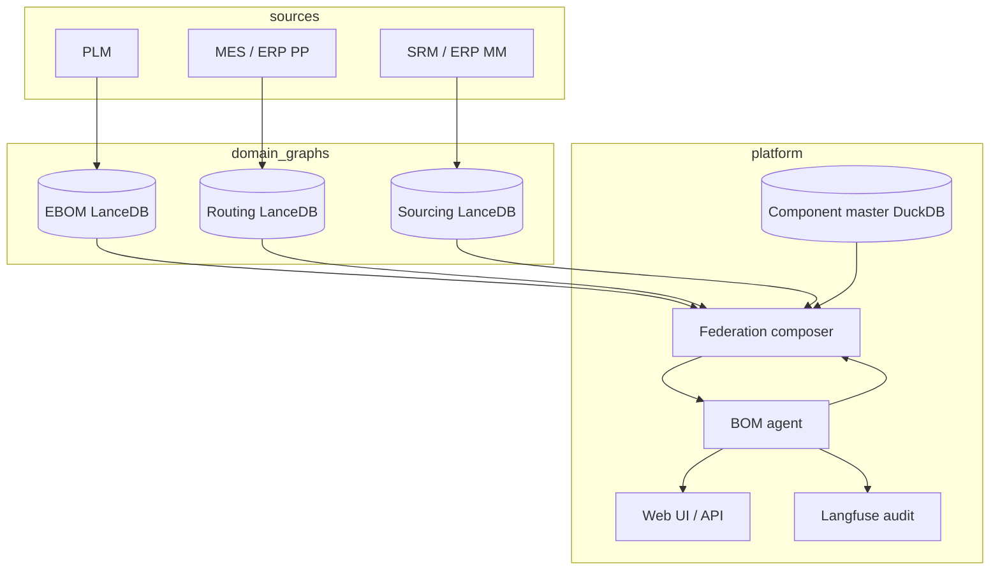
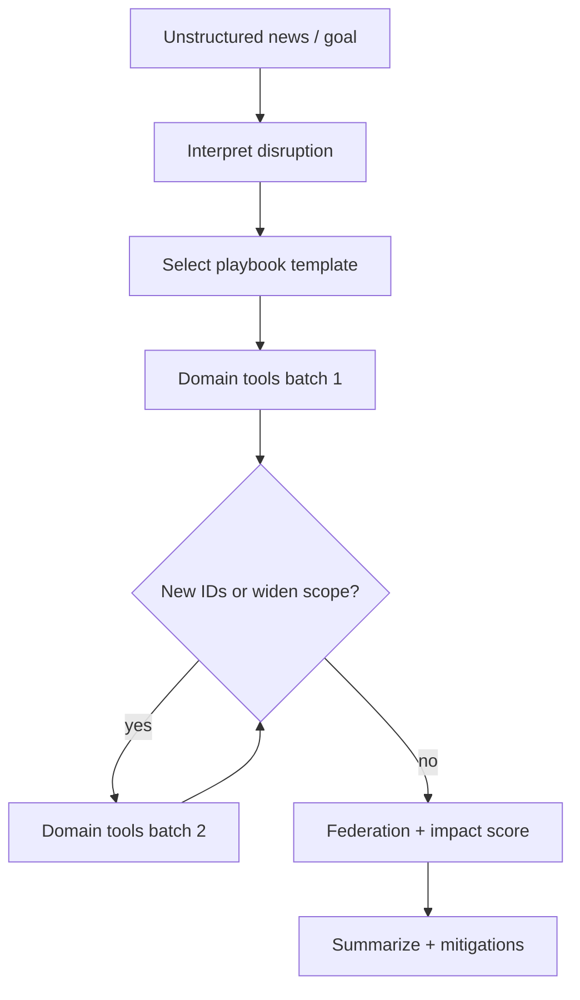
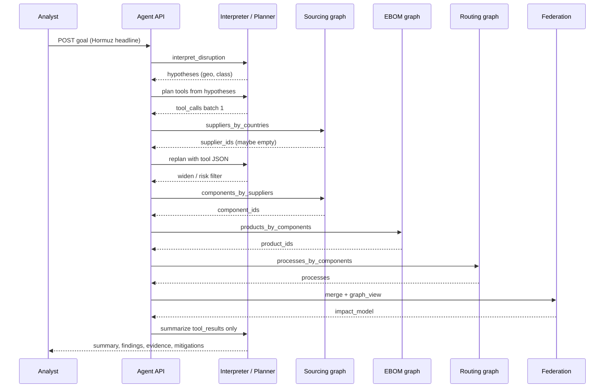

# Supply chain disruption: logical graph federation and agent response

Proposal for **immediate cross-domain impact analysis and mitigation guidance** when a supply chain disruption occurs. Three domain graphs are **owned and operated by separate teams** on separate source systems. The AI agent **does not merge graphs physically**; it **federates at query time** using shared entity IDs and a deterministic orchestration layer.

**Audience:** program managers, domain data owners (engineering, manufacturing, procurement), and agent platform developers.

**Related:** [enterprise-graph-design.md](enterprise-graph-design.md) (domain model and Neo4j layout), [graph-context.md](graph-context.md) (semantics and federation contract), [local-demo-runbook.md](local-demo-runbook.md) (running the agent), [observability.md](observability.md) (Langfuse traces for audit).

---

## 1. Use case statement

### 1.1 Trigger (unstructured, real-world)

In production, disruption signals rarely arrive as graph-native IDs. They arrive as **news, alerts, and narrative**, for example:

- “The **Strait of Hormuz** is effectively closed to commercial shipping.”
- “Earthquake near **Taiwan** — fabs and ports operating intermittently.”
- “EU announces **sanctions** on certain steel exporters.”
- “Major **ransomware** hit at a tier-1 automotive supplier.”

These inputs are **not** shaped for Lance table layout, `graph_id`, or `SUP-001`. The agent must:

1. **Interpret** the signal (what kind of disruption, which regions, materials, or lanes are plausibly affected).
2. **Anchor** interpretation to **graph entry points** (supplier country, material, port/lane metadata, work center) using ontology semantics and tools — not free-form graph traversal in the LLM.
3. **Plan exploration** across the three domain graphs (which tools, which order, when to stop).
4. **Federate logically** on `Component.id` / `Product.id` and produce grounded impact analysis.

Structured IDs such as `SUP-001` or `WC-12` may appear **after** anchoring (extracted from tool results or mentioned in internal war-room notes). They are **outputs of interpretation**, not the primary user input format.

### 1.2 Underlying disruption types (after interpretation)

Once interpreted, most events reduce to a small set of **graph-anchorable** patterns:

| Interpreted pattern | Typical graph entry | Primary domain |
|---------------------|---------------------|----------------|
| Geo / maritime chokepoint | `Supplier.country`, lane/port edge properties | Sourcing |
| Supplier-specific failure | `Supplier.id` | Sourcing |
| Plant / work center outage | `Process.work_center` | Routing |
| Part quality or hold | `Component.id` | EBOM |
| Commodity / material shock | `Component.material`, category tags | Sourcing → EBOM |

Business impact is **always cross-domain** once anchored: a Hormuz headline affects **sourcing exposure first**, then **EBOM where-used**, then **routing** if inbound timing changes manufacturing.

### 1.3 Goal

Within minutes of the event:

1. **Quantify impact** — affected components, products, processes, revenue exposure, time-to-impact.
2. **Explain causality** — traceable path from event → component → product → customer-facing SKU.
3. **Recommend actions** — grounded mitigations per owning team (alternate source, reroute, ECO, build ahead), with confidence and evidence.
4. **Preserve domain ownership** — no team surrenders its graph; federation is read-only and auditable.

### 1.4 Non-goals

- Replacing domain systems (PLM, MES, SRM) as systems of record
- Physically copying all three graphs into one warehouse for every query
- Letting the LLM invent part numbers, suppliers, or routings not present in tool output
- Expecting operators to pre-map news headlines to graph IDs before calling the agent
- Letting the LLM **walk the graph mentally** without deterministic tool calls

---

## 2. Domain ownership model

Each domain is a **bounded context** with its own ingest pipeline, ontology bundle, LanceDB dataset, and operating team.

| Domain | Graph name | Source systems (typical) | Owning team | Graph SLA (example) |
|--------|------------|--------------------------|-------------|---------------------|
| **Product structure** | EBOM graph | PLM | Engineering / PLM admin | On ECO release (hours) |
| **Manufacturing routing** | Routing graph | MES, ERP PP | Manufacturing engineering | Daily or on routing change |
| **Supply & sourcing** | Sourcing graph | SRM, ERP MM | Procurement / supply chain | On supplier event or daily |

### 2.1 What each team maintains

| Team | Responsible for | Not responsible for |
|------|-----------------|---------------------|
| Engineering | `Component`, `Product`, `USED_IN`; revisions; where-used accuracy | Supplier contracts, shop-floor sequences |
| Manufacturing | `Process`, `INPUT_OF`, `PRODUCED_BY`; work centers; cycle times | Vendor risk scores, EBOM release policy |
| Procurement | `Supplier`, `SUPPLIED_BY`; lead time, risk, alternates | Product BOM structure, routing logic |

### 2.2 Federation contract (shared keys)

Cross-domain analysis is only possible if all three teams honor the same **bridge identifiers**:

| Entity | ID field | Must match across domains |
|--------|----------|---------------------------|
| Component | `Component.id` (e.g. `COMP-103`) | **Yes** — primary join key |
| Product | `Product.id` (e.g. `PROD-901`) | **Yes** — structure ↔ routing |
| Supplier | `Supplier.id` | Sourcing only (referenced in events) |
| Process | `Process.id` | Routing only |

A lightweight **component master** in DuckDB (`data/bom.duckdb` in this repo) holds canonical names, materials, and costs for reporting. Domain graphs may duplicate `Component` nodes; federation joins on `id`, not on node storage location.

---

## 3. Logical integration vs physical integration

### 3.1 Physical separation (enterprise default)

```
data/
  lancedb-ebom/      ← Engineering pipeline writes here
  lancedb-routing/   ← Manufacturing pipeline writes here
  lancedb-sourcing/  ← Procurement pipeline writes here
  bom.duckdb         ← Shared component master (read-mostly for all)
```

Each team validates writes against the **domain subset** of `ontology/schema.py` (see [enterprise-graph-design.md](enterprise-graph-design.md) §5.1).

### 3.2 Logical integration (agent query time)

The agent **never** materializes a fourth “uber-graph” for routine analysis. Instead:

```
News / alert (unstructured)
       │
       ▼
┌──────────────────┐
│ Interpretation   │  LLM: disruption class, regions, materials, confidence
│ (no graph walk)  │  + ontology glossary (Skills)
└────────┬─────────┘
         ▼
┌──────────────────┐
│ Anchoring plan   │  map hypotheses → tool calls + graph entry filters
│ (planner)        │  e.g. countries [AE, SA, …], materials [Steel]
└────────┬─────────┘
         ▼
   ┌─────┴─────┬─────────────┐
   ▼           ▼             ▼
 Sourcing    EBOM        Routing
  graph       graph        graph   ← separate Lance paths; tools per domain
   │           │             │
   └─────┬─────┴─────────────┘
         ▼
┌──────────────────┐
│ Federation layer │  join on Component.id / Product.id
└────────┬─────────┘
         ▼
┌──────────────────┐
│ Impact report +  │  LLM summarizes tool JSON only
│ mitigations      │
└──────────────────┘
```

**Critical split:**

| Phase | LLM role | Graph role |
|-------|---------|------------|
| Interpretation | Classify news, extract **hypotheses** (region, commodity, severity) | None — no IDs invented |
| Anchoring / planning | Choose tools and arguments bounded by ontology | Tools query Lance |
| Federation | Narrate merged tool results | Python joins on bridge keys |

**Logical integration** means:

- Traversal stays **inside** one domain graph per tool call
- **Component IDs** link results across steps
- The **federation layer** merges tabular/graph views for the UI (`graph_view`) and evidence
- Ontologies stay **three explainable bundles** for Skills and auditors

### 3.3 Why not merge physically on disruption?

| Approach | Problem |
|----------|---------|
| Nightly unified graph | Stale within hours; routing and sourcing change intraday |
| ETL merge on alert | Minutes of latency; duplicate governance; unclear owner of merged store |
| LLM over raw exports | Hallucination risk; no deterministic traversal |

Federation at query time uses **live domain graphs** (each at its own `as_of`) and completes in seconds on LanceDB with in-process traversal (as `LanceGraphStore` does today).

---

## 4. Disruption response architecture

### 4.1 Components



| Component | Role |
|-----------|------|
| Domain ingest | Team-owned connectors; Pydantic validation on every write |
| Domain graph store | `LanceGraphStore` per domain (separate LanceDB path) |
| Component master | Scalar attributes, optional identity aliases |
| **Federation composer** | Multi-step plans; ID joins; unified `graph_view` |
| **BOM agent** | Interpretation, exploration planning, tool execution, grounded narrative |
| Langfuse | Interpretation, planner, per-tool JSON (not end-user UI) |

### 4.2 Unstructured intake (primary)

**User / system input** is natural language or a news payload:

```json
{
  "goal": "Strait of Hormuz closure reported — what is our exposure?",
  "source": "reuters_alert",
  "published_at": "2026-06-01T08:50:00Z",
  "raw_text": "Shipping insurers warn of effective closure of the Strait of Hormuz..."
}
```

Or simply paste the headline into the existing UI (`POST /v1/agent/run` with `goal`).

No `Supplier.id`, no `graph_id`, no assumption that the operator knows physical graph layout.

### 4.3 Interpretation layer

The **interpretation step** produces a **hypothesis object** (internal, logged to Langfuse). It is **not** trusted for facts about *your* supply chain until tools confirm.

```json
{
  "disruption_class": "maritime_chokepoint",
  "summary": "Strait of Hormuz — Middle East Gulf shipping disruption",
  "geo_hypotheses": [
    { "region": "Persian Gulf", "countries": ["AE", "SA", "QA", "KW", "OM", "IR"], "confidence": "medium" }
  ],
  "material_hypotheses": [
    { "material": "petrochemicals", "confidence": "low" },
    { "material": "Steel", "confidence": "low", "rationale": "indirect via shipping cost/delay" }
  ],
  "logistics_hypotheses": [
    { "lane": "Hormuz", "effect": "transit_delay" }
  ],
  "suggested_entry_domain": "sourcing",
  "exploration_strategy": "geo_supplier_filter_then_ebom_then_routing"
}
```

| Interpretation output | Used for |
|-----------------------|----------|
| `disruption_class` | Playbook template selection (§5) |
| `geo_hypotheses.countries` | `sourcing.suppliers_by_countries([...])` |
| `material_hypotheses` | `sourcing.components_by_material` / hybrid vector query |
| `suggested_entry_domain` | First graph to query |
| `confidence` | Whether to widen search or ask clarifying question |

**Guardrails:**

- Interpretation **must not** emit `COMP-xxx` / `SUP-xxx` unless quoted from input text.
- Country lists for maritime events may come from a **curated gazetteer** Skill appendix (Hormuz → Gulf states), not from model memory alone — merge gazetteer with LLM extraction in production.
- Low-confidence hypotheses still run tools with **explicit “scenario” labeling** in the report.

### 4.4 Derived incident model (internal, optional)

After interpretation and **first tool hop**, the platform may materialize a structured record for ticketing — this is **downstream**, not user input:

```json
{
  "event_id": "INC-2026-0142",
  "event_type": "maritime_chokepoint",
  "source_goal": "Strait of Hormuz closure reported — what is our exposure?",
  "anchored_entities": [
    { "label": "Supplier", "id": "SUP-001", "via": "country=JP", "note": "indirect exposure if lane affects JP imports" }
  ],
  "severity": "high",
  "declared_at": "2026-06-01T09:15:00Z"
}
```

`event_type` values include: `maritime_chokepoint`, `supplier_disruption`, `work_center_outage`, `component_hold`, `sanctions`, `commodity_shock`.

The agent maps `disruption_class` / `event_type` → **exploration playbook** (§5), then **refines** the plan after each tool result (multi-round planner).

---

## 5. Exploration playbooks (after interpretation)

Playbooks are **default tool sequences** for an interpreted `disruption_class`. They are not hard-coded to graph IDs from the news.

| Stage | Who decides | What is decided |
|-------|-------------|-----------------|
| **Interpretation** | LLM + Skills (gazetteer, ontology) | Disruption class, regions, materials, entry domain |
| **Initial plan** | LLM planner or rule engine | Playbook + first tool batch |
| **Refinement** | LLM or rules after each tool JSON | Add hops (e.g. widen countries), stop when coverage sufficient |
| **Traversal** | Python tools on Lance | Deterministic graph math |

**Graph math always runs in Python**, not in the model.

### 5.0 Exploration strategy decision (agent judgment)

How the agent chooses **where to start** and **how to expand**:

```text
IF interpretation.geo_hypotheses present
    START sourcing → suppliers/components filtered by country or lane metadata
    THEN ebom → products_by_components
    THEN routing IF lead_time or inbound timing cited
ELIF interpretation names material/commodity
    START hybrid or sourcing → components_by_material
    THEN ebom → where_used
    THEN sourcing → suppliers_for_components
ELIF interpretation names supplier company (text match)
    START sourcing → resolve supplier id (search tool)
    THEN standard supplier_disruption chain
ELIF interpretation names plant/work center
    START routing → products_by_work_center
    THEN ebom + sourcing
ELSE
    START sourcing (broadest exposure) OR ask clarifying question
```

**Stopping rules** (avoid infinite tool loops):

- No new `component_id` or `product_id` in last hop
- `impact_score` plateau across widening geo filter
- Max tool rounds (e.g. 6) — configurable
- User mode `tools` uses a fixed playbook without refinement

### 5.1 Playbook: `maritime_chokepoint` (e.g. Strait of Hormuz)

**Trigger:** News about a strait, canal, or port blockade; interpretation `disruption_class = maritime_chokepoint`.

**Interpretation example:** Hormuz → Persian Gulf states; secondary effect on global shipping lanes and energy-intensive materials.

| Step | Domain | Tool (proposed) | Purpose |
|------|--------|-----------------|---------|
| 0 | — | `interpret_disruption(goal)` | Hypothesis object (§4.3) |
| 1 | Sourcing | `sourcing.suppliers_by_countries(countries)` | Anchor news to suppliers in graph |
| 2 | Sourcing | `sourcing.components_by_suppliers(supplier_ids)` | Exposed components + lead times |
| 3 | EBOM | `ebom.products_by_components(component_ids)` | Finished goods impact |
| 4 | Routing | `routing.processes_by_components(component_ids)` | Manufacturing sensitivity |
| 5 | Master | `master.component_attributes(component_ids)` | Cost exposure |
| 6 | Federation | `federation.build_impact_graph(...)` | Unified map + ranking |

**Ontology enrichment (enterprise):** add optional edge/node properties in sourcing ingest — `shipping_lane`, `primary_port`, `transit_region` — so Hormuz news maps to **data-backed** filters, not only `Supplier.country`. See [graph-context.md](graph-context.md).

**Demo limitation:** Seeded suppliers use `country` only (`JP`, `DE`, `US`). A Hormuz scenario in demo may show **low direct Gulf exposure** but still demonstrate the pipeline; production graphs include Gulf/Middle East suppliers and lane metadata.

### 5.2 Playbook: `supplier_disruption`

**Trigger:** Interpretation resolves to a specific supplier, or war-room input names `SUP-xxx` after initial search.

| Step | Domain | Tool (proposed) | Output keys |
|------|--------|-----------------|-------------|
| 1 | Sourcing | `sourcing.components_by_supplier(supplier_id)` | `component_ids[]`, lead times, alternates |
| 2 | EBOM | `ebom.products_by_components(component_ids)` | `product_ids[]`, where-used count |
| 3 | Routing | `routing.processes_by_components(component_ids)` | `process_ids[]`, work centers |
| 4 | Routing | `routing.products_by_processes(process_ids)` | confirm manufacturing path |
| 5 | Master | `master.component_attributes(component_ids)` | cost, material for exposure |
| 6 | Federation | `federation.build_impact_graph(...)` | `graph_view`, ranked impact |

**Repo today:** Steps 1–2 are partially covered by `bom_supplier_impact` (sourcing + structure in one physical graph). Splitting by domain store is the enterprise target.

### 5.3 Playbook: `work_center_outage`

**Trigger:** `work_center_outage`, entity `Process.work_center = WC-xxx`.

| Step | Domain | Tool | Purpose |
|------|--------|------|---------|
| 1 | Routing | `routing.products_by_work_center(wc)` | Finished goods at risk |
| 2 | Routing | `routing.components_by_work_center(wc)` | Material pinned at operations |
| 3 | EBOM | `ebom.bom_explode(product_ids)` | Full BOM context |
| 4 | Sourcing | `sourcing.supply_status(component_ids)` | Stock / lead time buffer |

### 5.4 Playbook: `component_hold`

**Trigger:** engineering hold on `Component.id`.

| Step | Domain | Tool | Purpose |
|------|--------|------|---------|
| 1 | EBOM | `ebom.where_used(component_id)` | Affected products |
| 2 | Routing | `routing.processes_for_component(component_id)` | Shop-floor impact |
| 3 | Sourcing | `sourcing.suppliers_for_component(component_id)` | Single-source risk |

### 5.5 Playbook selection and multi-round planning

| Input mode | Flow |
|------------|------|
| **News / headline (primary)** | `goal` text → interpret → playbook from `disruption_class` → tools → optional refine |
| **War-room narrative** | Same; may mix geo + supplier names in one message |
| **Structured follow-up** | Optional `POST /v1/agent/incident` with derived envelope (§4.4) for automation hooks |
| **Known ID in text** | Heuristic extracts `SUP-xxx` / `COMP-xxx` → skip broad geo filter |



Heuristic patterns exist today for **ID-shaped** goals in `plan_tools_from_goal` (`app/agent/runner.py`). Enterprise extension:

- `interpret_disruption` tool or LLM pass before planning
- Playbook registry keyed by `disruption_class`
- **Re-plan loop** fed with tool JSON (LangGraph-style), capped by max rounds

---

## 6. Impact analysis output

### 6.1 User-facing report (web UI)

Align with existing UI fields ([README.md](../README.md)):

| Field | Disruption content |
|-------|-------------------|
| **Summary** | What happened, scope in plain language |
| **Key findings** | Counts: N components, M products, K work centers; time-to-impact |
| **Evidence** | Grounded claims per domain (no raw tool names in UI) |
| **Supply chain map** | Federated `graph_view`: supplier → component → product → process |

### 6.2 Impact dimensions

| Dimension | Source domain | Metric examples |
|-----------|---------------|-----------------|
| **Commercial** | EBOM + master | Extended cost `Σ(component.cost × qty)` |
| **Fulfillment** | Sourcing | Max `lead_time_days`; single-source flags |
| **Manufacturing** | Routing | Affected `work_center`; added `cycle_time_min` if reroute |
| **Portfolio** | EBOM | Product list sorted by revenue priority (from ERP feed in master) |

### 6.3 Severity scoring (deterministic)

Example rule-based score for ranking (implemented outside LLM):

```
impact_score = w1 * affected_product_count
             + w2 * total_at_risk_cost
             + w3 * single_source_component_count
             + w4 * min_days_to_stockout
```

Weights are business-tunable. LLM **narrates** the score; it does not compute it.

---

## 7. Mitigation recommendations

Recommendations are **templates filled from tool data**. Each action names an **owning team** and cites evidence.

### 7.1 Recommendation categories

| Category | Owner | When suggested | Data required |
|----------|-------|----------------|---------------|
| **Alternate supplier** | Procurement | `alternate_supplier_id` on component or SRM feed | Sourcing graph |
| **Substitute part (ECO)** | Engineering | Alternate material in PLM or approved substitute list | EBOM + engineering policy DB |
| **Reroute / outsource** | Manufacturing | Alternate `Process` with spare capacity | Routing graph |
| **Build ahead** | Planning | Positive inventory buffer in ERP | Master / ERP (future) |
| **Customer comms** | Program mgmt | High `impact_score` on shipped products | EBOM product list |

### 7.2 Example output (supplier disruption)

For `SUP-001` disruption on seeded demo data:

| Priority | Action | Owner | Evidence |
|----------|--------|-------|----------|
| 1 | Qualify `SUP-003` for `COMP-100` (steel frame) | Procurement | Only `SUP-001` on record; `lead_time_days: 21` |
| 2 | Assess ECO for `COMP-102` housing material | Engineering | `USED_IN` → `PROD-900`; high unit cost |
| 3 | Reschedule `WC-12` assembly for `PROD-900` | Manufacturing | `INPUT_OF` → `PROC-30` depends on delayed components |
| 4 | Notify program office for Industrial Pump line | Program mgmt | 3 components on `PROD-900` from `SUP-001` |

The LLM formats these rows **only if** tool results contain the cited IDs and fields (`app/agent/llm_client.py` grounding contract).

### 7.3 What the agent must not do

- Approve ECOs or purchase orders (recommend only)
- Hide conflicting `as_of` timestamps across domains
- Merge graphs write-back into a domain store

---

## 8. End-to-end scenario walkthrough

### 8.1 Scenario A — News: Strait of Hormuz (unstructured input)

**08:50** — Reuters alert: insurers warn of effective **closure of the Strait of Hormuz**. Analyst pastes headline into agent UI:

```text
Strait of Hormuz closure reported — what is our supply chain exposure?
```

**08:51 — Interpretation (LLM + gazetteer Skill):**

- `disruption_class`: `maritime_chokepoint`
- `geo_hypotheses`: Gulf states `AE, SA, QA, KW, OM` (and optionally wider MENA if first hop empty)
- `suggested_entry_domain`: sourcing
- No fabricated `SUP-xxx` / `COMP-xxx`

**08:51 — Planning:** Agent selects playbook `maritime_chokepoint`, batch 1:

1. `sourcing.suppliers_by_countries(["AE","SA","QA","KW","OM"])` → in production, returns Gulf-tier suppliers; **demo seed may return empty** (only JP/DE/US).
2. Agent **refines** (judgment): widen to **shipping-lane exposure** or `risk_level=High` suppliers if geo filter empty; run `sourcing.suppliers_by_risk("High")` → demo hits `SUP-001` (Nihon Steel).
3. `sourcing.components_by_suppliers(["SUP-001", ...])` → component IDs + lead times.
4. `ebom.products_by_components(...)` → `PROD-900`, `PROD-901`, etc.
5. `routing.processes_by_components(...)` → `PROC-10`, `PROC-30`, work centers.
6. Federation merges on `Component.id`; impact score from deterministic formula (§6.3).

**08:52 — Response:** Summary explains **two layers**:

- *Direct:* suppliers registered in Gulf countries (data-backed count).
- *Scenario / indirect:* high-risk or lane-affected suppliers identified after refinement (clearly labeled).

Evidence cites tool JSON only. Map shows federated supplier → component → product → process.

**Operator audit (Langfuse):** full interpretation object, each tool call, re-plan decisions, domain `as_of`.

### 8.2 Scenario B — War-room: known supplier ID (structured mid-flight)

**09:15** — Procurement confirms `SUP-001` (Nihon Steel) cannot ship for 30 days.

Input may be: `"Nihon Steel SUP-001 halt — impact?"` Heuristic extracts `SUP-001` → playbook `supplier_disruption` without geo widening.

1. **Sourcing:** 6 components; average lead time 18 days.
2. **EBOM:** `PROD-900`, `PROD-901`; `COMP-100` highest cost.
3. **Routing:** `PROC-10`, `PROC-20`, `PROC-30`; `PROD-900` → `WC-12`.
4. Federation + mitigations as in §7.2.

This is the **fast path** when interpretation anchors immediately to a graph ID.

### 8.3 Sequence diagram (news-driven)



### 8.4 Demo mapping (current repository)

Today’s single LanceDB graph can **simulate** the playbook without three physical stores:

| Playbook step | Current implementation |
|---------------|------------------------|
| Sourcing hop | `LanceGraphStore.impacted_products_by_supplier` — `SUPPLIED_BY` |
| EBOM hop | Same method — `USED_IN` |
| Routing hop | Not exposed; `bom_supply_path` uses `INPUT_OF` / `PRODUCED_BY` |
| Agent entry | `POST /v1/agent/run` with `bom_supplier_impact` or LLM planner |

**Gap to close for full scenario:** `interpret_disruption`, geo/lane sourcing tools, domain-scoped stores, routing impact tools, multi-round planner, mitigation templates.

| News-style goal (today) | Behavior |
|-------------------------|----------|
| Hormuz / geo headline | LLM planner if configured; else may return no tools — needs interpretation + sourcing filters |
| Contains `SUP-xxx` + impact | `bom_supplier_impact` (heuristic) |
| Material / steel / similar | `bom_hybrid_query` |

---

## 9. API and agent integration

### 9.1 Primary API (unstructured — use today)

```
POST /v1/agent/run
Content-Type: application/json

{ "goal": "Strait of Hormuz closure — what is our exposure?", "mode": "auto" }
```

`goal` is the **only required** disruption input. Optional fields for production:

```json
{
  "goal": "...",
  "mode": "auto",
  "context": {
    "source": "reuters_alert",
    "published_at": "2026-06-01T08:50:00Z",
    "raw_text": "..."
  }
}
```

### 9.2 Proposed incident endpoint (derived / automation)

For ticketing systems **after** a run anchors entities:

```
POST /v1/agent/incident
Content-Type: application/json

{ "goal": "...", "mode": "auto" }
```

Or attach a derived envelope from a prior run (§4.4). Response extends `/v1/agent/run` with:

```json
{
  "interpretation": {
    "disruption_class": "maritime_chokepoint",
    "geo_hypotheses": [{ "countries": ["AE", "SA"], "confidence": "medium" }]
  },
  "playbook": "maritime_chokepoint",
  "plan_rounds": 2,
  "impact_score": 87.5,
  "mitigations": [ { "action": "...", "owner": "Procurement", "priority": 1 } ],
  "domain_snapshots": {
    "sourcing": { "as_of": "2026-06-01T08:00:00Z" },
    "ebom": { "as_of": "2026-06-01T06:00:00Z" },
    "routing": { "as_of": "2026-06-01T07:30:00Z" }
  }
}
```

### 9.3 Agent modes

| Mode | Behavior on incident |
|------|----------------------|
| `tools` | Playbook only; no LLM; fastest for automation |
| `llm` | LLM narrates and ranks mitigations from tool JSON |
| `auto` | LLM if gateway configured; else `tools` |

### 9.4 Skills

| Skill | Responsibility |
|-------|----------------|
| `bom-ontology` | Domain bundles; edge direction semantics |
| `bom-graph-explorer` | Per-domain traversal rules |
| `bom-disruption-response` (proposed) | Playbooks, **geo gazetteer** (Hormuz → countries), mitigation templates |
| `bom-news-interpretation` (proposed) | Disruption classes, hypothesis schema, when to widen vs stop |

Workflow references live under `skills/`; behavioral guidance stays out of `app/tools.py` (see [AGENTS.md](../AGENTS.md)).

---

## 10. Governance, audit, and trust

| Requirement | Mechanism |
|-------------|-----------|
| Domain write authority | Only domain pipeline writes to its LanceDB path |
| Read-only federation | Agent tools open read handles; no cross-domain writes |
| Audit trail | Langfuse: playbook, each tool call, domain `as_of` |
| Evidence for compliance | User evidence cites facts; operators inspect full JSON in Langfuse |
| Stale data visibility | `domain_snapshots` in response when SLAs differ |
| Identity disputes | Component master workflow owned by data governance council |

---

## 11. Implementation roadmap (this repository)

| Phase | Deliverable | Owner |
|-------|-------------|-------|
| **P0** (now) | `bom_supplier_impact`, hybrid query, agent UI, `POST /v1/agent/run` with `goal` | ID-shaped and material queries |
| **P1** | `interpret_disruption` + geo gazetteer Skill; LLM planner uses hypotheses | Agent |
| **P2** | Sourcing filters (`suppliers_by_countries`, `by_risk`, lane metadata on ingest) | Procurement |
| **P3** | `graph_id` or separate Lance paths; routing tools | Platform + manufacturing |
| **P4** | `GraphFederationStore` + multi-round planner + mitigation templates | Platform |
| **P5** | Live connectors (PLM / MES / SRM / news feed) | Domain teams |

Each phase keeps **logical federation**; physical split lands when procurement and manufacturing pipelines are ready.

---

## 12. Summary

| Topic | Design choice |
|-------|----------------|
| Input | **Unstructured news / narrative** — not graph-shaped IDs |
| Interpretation | LLM + Skills → hypotheses; **no supply-chain IDs invented** |
| Exploration | Agent **judges** entry domain, playbook, widen/stop from tool JSON |
| Domains | EBOM, routing, sourcing — **three teams, three Lance paths** |
| Integration | **Logical only** — federation at query time via `Component.id` / `Product.id` |
| Disruption flow | News → interpret → plan → domain tools (multi-round) → merge → report |
| Agent role | Interpret, plan, execute tools, explain — **not** mental graph walk or physical merge |
| Mitigations | Template-based, team-tagged, evidence-linked; label indirect scenarios clearly |

This use case is the **primary justification** for domain-separated graphs with a shared federation layer: normal operations stay decentralized; **crisis response is centralized in the agent** without violating data ownership.

---

## Related documentation

| Document | Contents |
|----------|----------|
| [graph-context.md](graph-context.md) | Semantics, federation keys, lane/country enrichments |
| [enterprise-graph-design.md](enterprise-graph-design.md) | Domain model, Lance phases, ontology bundles |
| [development.md](development.md) | Local setup, tests, phased implementation roadmap (P0–P5) |
| [observability.md](observability.md) | Langfuse traces for playbooks |
| [local-demo-runbook.md](local-demo-runbook.md) | Run agent + UI locally |
